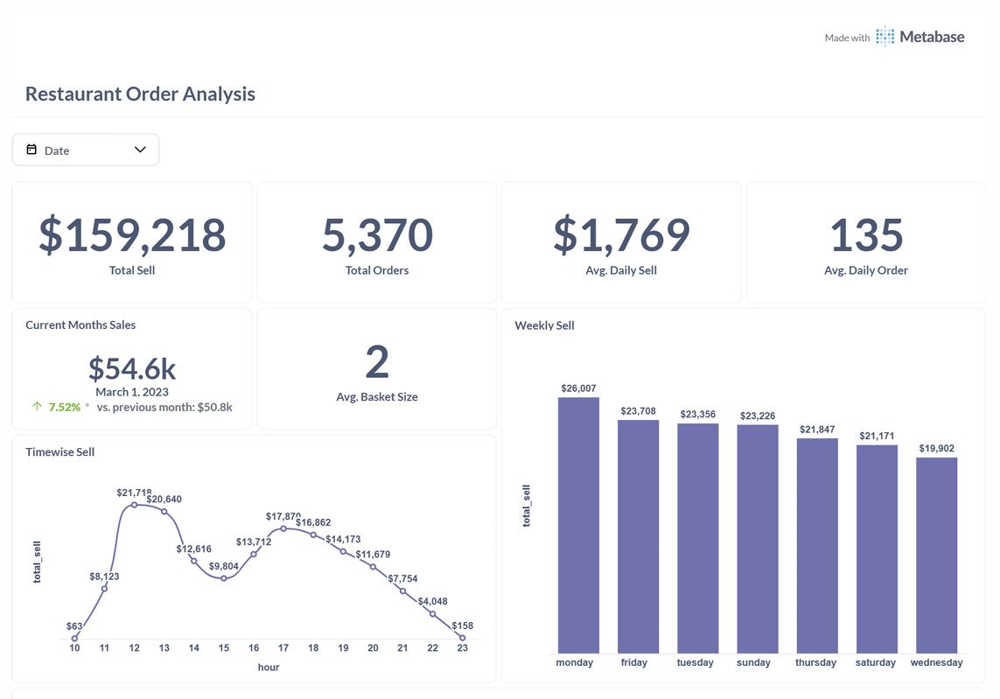
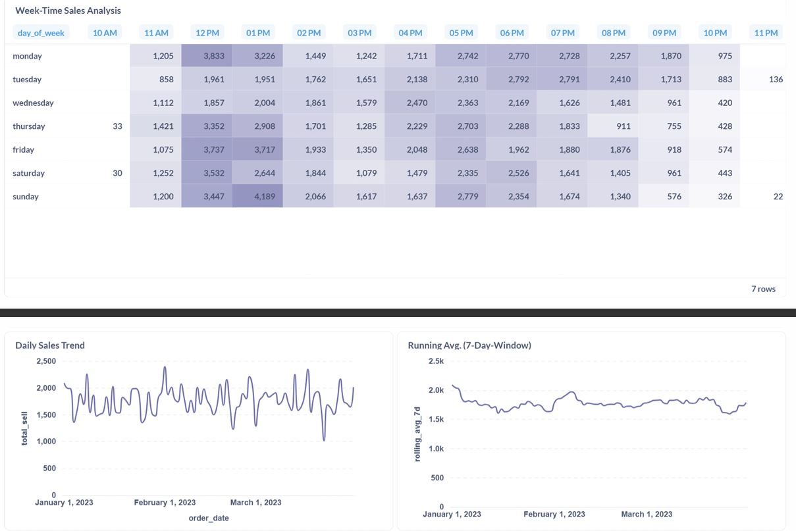
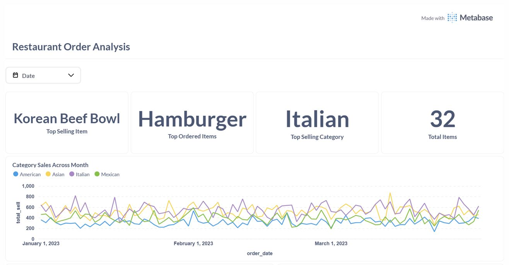
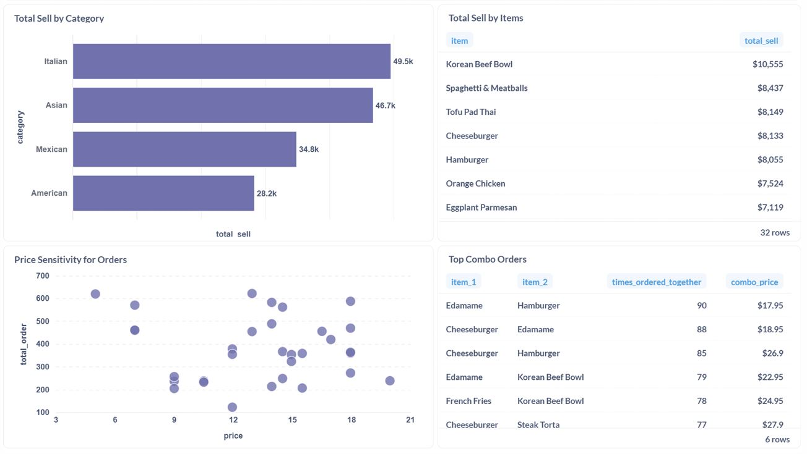

# 🍽️ Restaurant Order & Menu Analysis Dashboard

This project presents a complete end-to-end **data analysis and business intelligence solution** for a restaurant using SQL, PostgreSQL, Supabase, and Metabase. It provides dynamic dashboards with automated updates and email reporting to support data-driven decisions.

---

## 📌 Project Overview

This is a **fully dynamic dashboard** that analyzes restaurant order patterns, menu performance, and operational trends using:

- 🛠️ **PostgreSQL** – For structured data storage (hosted on **Supabase**)
- 📊 **Metabase** – For interactive dashboard and visualization
- 📡 **SMTP Integration** – For sending daily email reports to stakeholders

✅ The dashboard **auto-refreshes every 30 minutes**  
✅ Reports are **automatically emailed daily**

---

## 🧠 Key Business Insights

### ⏰ Sales Timing Optimization
- Sales are consistently low **between 10 AM – 11 AM** and **after 10 PM**
- ⚠️ These time slots generate almost no revenue but still incur operating costs  
➡️ **Recommendation**: Shift shop hours to **11 AM – 10 PM** to reduce overhead and maximize ROI

### 🧾 Combo Opportunity from Item Affinity
- Frequently paired items include:
  - *Edamame + Hamburger*
  - *French Fries + Korean Beef Bowl*
  - *Cheeseburger + Edamame*
- ⚡ Customers often buy these together  
➡️ **Recommendation**: Offer them as **combo deals with discounts** to increase order value

---

## 🖼️ Dashboard Snapshots

Below are the key views from the Metabase dashboard:

---

## 📬 Automation Features

- **Automatic 30-minute refresh** using Metabase scheduling
- **SMTP server integration** for sending daily email summaries
- Dashboards are **interactive and filterable** by time, item, and category

---

## 🛠️ Tech Stack

| Component      | Tool/Platform        |
|----------------|----------------------|
| Database       | PostgreSQL (via Supabase) |
| BI Dashboard   | Metabase             |
| Backend Hosting| Supabase             |
| Email Reports  | SMTP Server          |
| Query Language | PostgreSQL           |

---

## 👨‍💻 Author

**Tanvir Taushif**  
📫 Email: tanvirpial9961@gmail.com  
🔗 [LinkedIn](https://www.linkedin.com/in/tanvir-taushif/)  
🌐 [GitHub Portfolio](https://github.com/Tanvir-Taushif)

---

## ⭐ If you liked this project...

Feel free to ⭐️ star the repo or fork it for your own use. Feedback is welcome!
